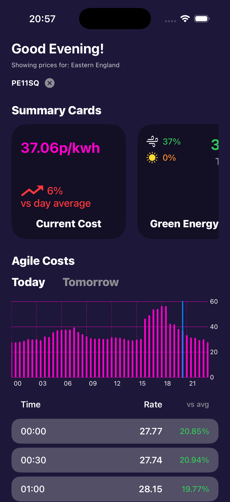
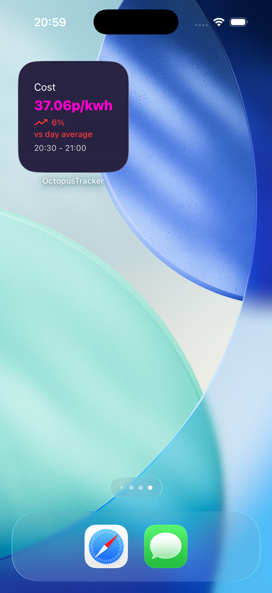
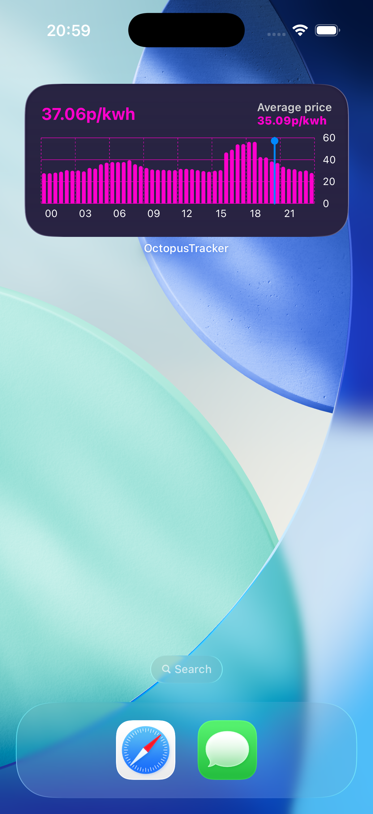

# Octopus Agile Tracker

iOS app and Home Screen widgets for live Octopus Agile half-hourly prices.

  
  &nbsp;
  
  &nbsp;
  

Enter a UK postcode. See the current slot, how it compares to the day average, today's (and tomorrow's) Agile curve, and pin the same data to the Home Screen.

## Features

- **Current cost** — live Agile unit rate in p/kWh, with % vs the day average
- **Region from postcode** — maps your postcode to a grid supply point (e.g. Eastern England)
- **Today / Tomorrow chart** — 48 half-hour bars, current slot marked
- **Half-hourly list** — each slot with rate and % vs average
- **Green energy card** — wind / solar mix alongside the price
- **Home Screen widgets**
  - Small: current rate, vs-average, and slot window
  - Medium: current rate, day average, and the full-day chart

## Requirements

- Xcode 16+
- iOS 18.5+
- Swift 5

## Data Sources
- **Octopus Energy API** — Agile half-hourly unit rates and postcode-to-region lookup (`api.octopus.energy`). Uses the `AGILE-24-10-01` tariff. [Docs](https://developer.octopus.energy/rest/guides/api-basics)
- **National Grid ESO / Carbon Intensity API** — live generation mix, wind and solar share (`api.carbonintensity.org.uk`). [Docs](https://carbonintensity.org.uk/)

Not affiliated with or endorsed by Octopus Energy or National Grid ESO.